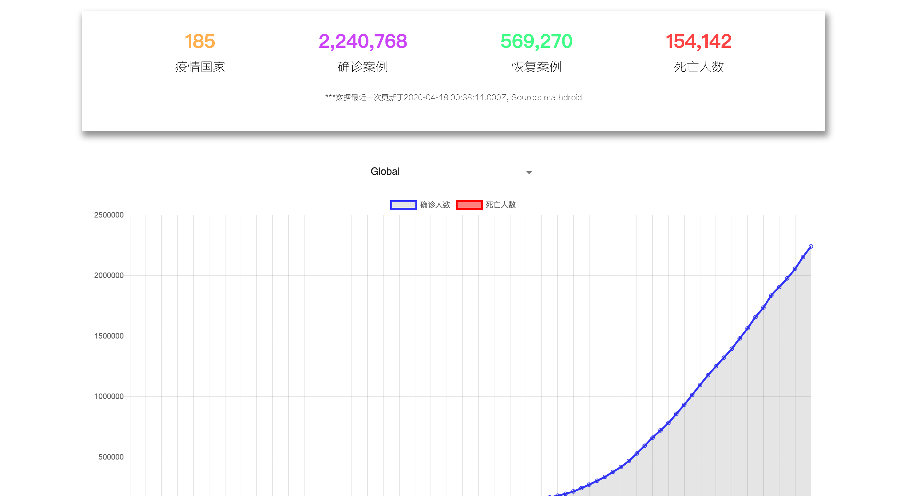

# COVID-19

> hosting link

## Table of Contents

- [Introduction](#01)
- [Features](#02)
- [Preview](#03)
- [Technology](#04)
- [Usage](#05)

#

## <span id="01">Introduction</span>

#

## <span id="02">Features</span>

- Tracks the latest data from mathdroid API
- Analysis case increment and changing using chart.js
- Feed latest top line breaknews relevent to Covid-19 from News.org API
- Demonstrates what is covid-19 and how should you protect you self

#

## <span id="03">Demo</span>

<i style="font-size: 13px">Intro section</i>


<i style="font-size: 13px">COVID-19 Statistics</i>


<i style="font-size: 13px">What is covid-19</i>


<i style="font-size: 13px">Covid-19 symptom</i>


<i style="font-size: 13px">How does covid-19 spread</i>


<i style="font-size: 13px">Preventation</i>


#

## <span id="04">Tools</span>

- HTML
- Sass
- javaScript
- React
- [News Org API](https://newsapi.org/)
- [mathdroid API](https://github.com/mathdroid/covid-19-api)
- Node.js
- chart.js
- AOS.js
- Firebase

#

## <span id="05">Run</span>

```markdown
npm start
```
